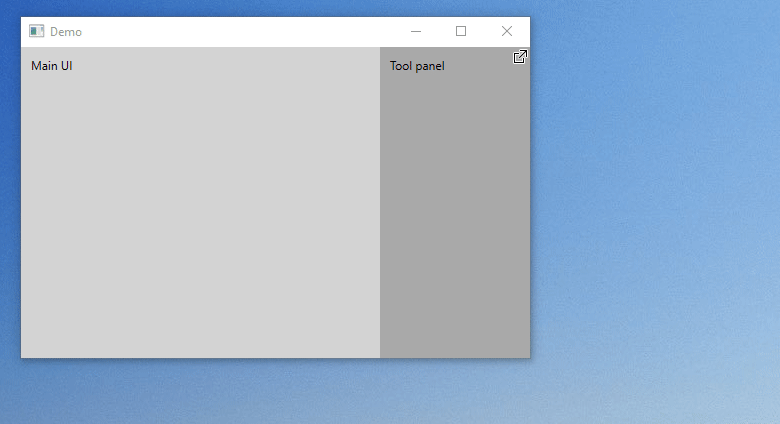

**DockFloat** provides a simple way to float and re-dock WPF UI elements. When re-docking a window, contents go back to their original location.



**To install**, just install the "DockFloat" NuGet package in your project.

**To make an element floatable**, just wrap it in a `Dock` (demo in source code):

```xml
<df:Dock xmlns:df="clr-namespace:DockFloat;assembly=DockFloat">
    <TextBlock Text="This can be floated and docked."/>
</df:Dock>
```