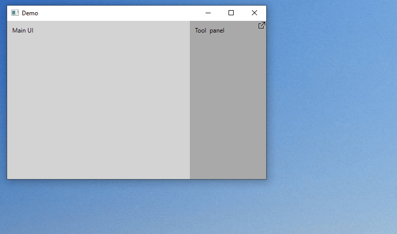

**DockFloat** provides a simple way to float and re-dock WPF UI elements. When re-docking a window, contents go back to their original, docked location.



**To install** DockFloat, build its project and add the resulting .dll to your project references. Hopefully I'll publish a .NuGet package soon.

**To make an element floatable**, just wrap it in a `Dock` (full demo in source code):

```xml
<df:Dock xmlns:df="clr-namespace:DockFloat;assembly=DockFloat">
    <TextBlock Text="This can be floated and docked."/>
</df:Dock>
```